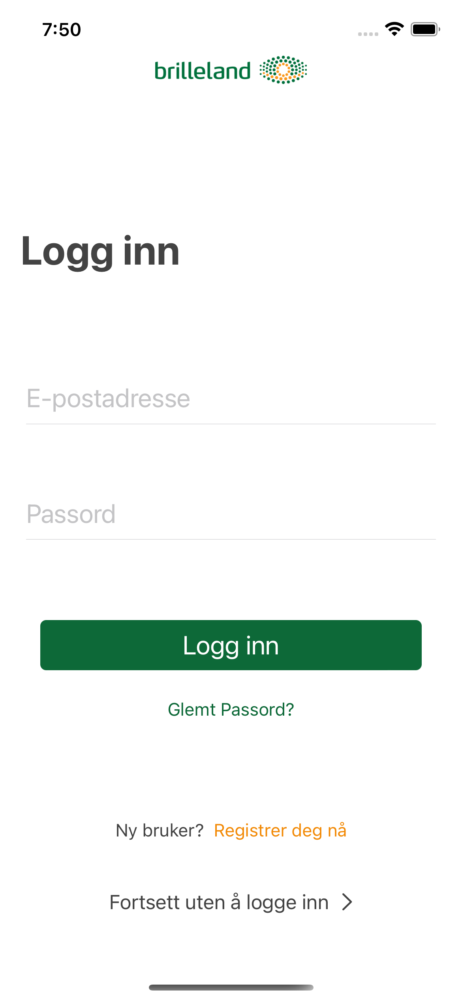
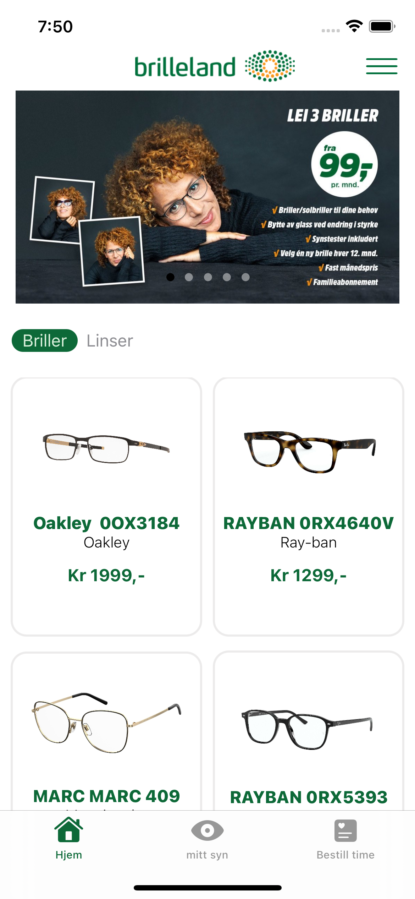
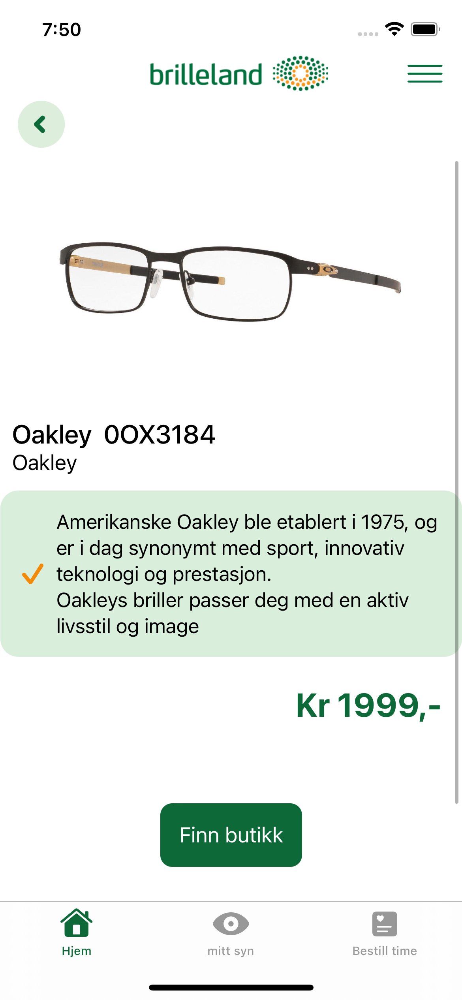
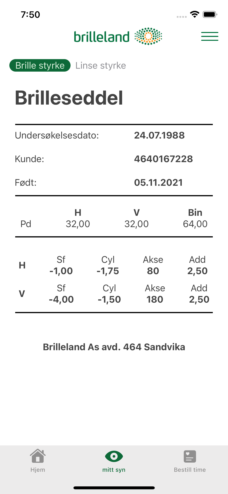

# Brilleland Concept app - E-commerce app for iOS in swift with SwiftUI 

An e-commerce app in the early stagges.

## Purpose

This app was originally developed as part of an assignment during my studies. 
I created this project because I was wondering how an e-commerce app would look like for the optical company *Brilleland*.

I had to put this project on pause due to new assignments and work. I find this project interesting because no optical companies in Norway has an app yet, and will continue on the project in the near future.

## Screenshots

   

<!--   -->

## Features to be implemented

- Firebase Authentication
- print/email prescription
- Google maps
- Biometrics
- Notifications

And more Views for other services *Brilleland* has to offer. 